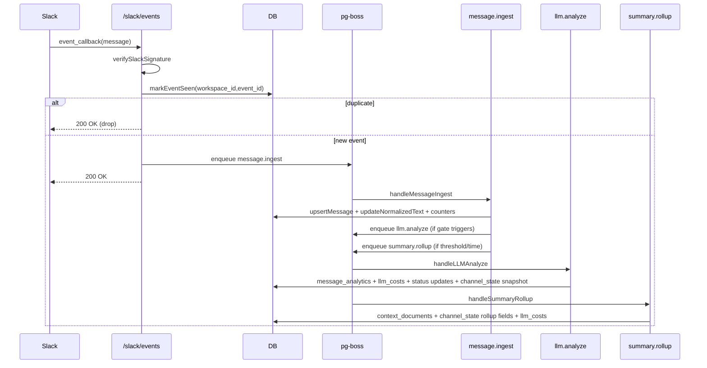
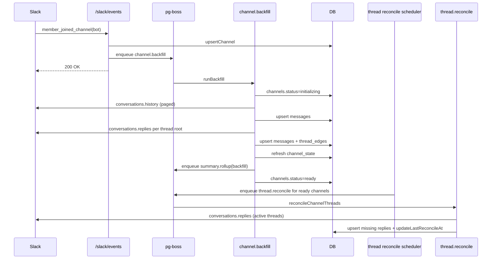

# Phase F System Walkthrough (As-Built + Caveats)

## Document intent
This is the standalone, source-of-truth walkthrough for the production Slack analysis bot implementation in this repository.

Use this file to answer, without opening source:
- What happens when a message arrives?
- How threads and users are tracked
- Where LLM calls happen and how failures are handled
- Which tables exist and what derived state is maintained
- Which background jobs run and why
- Which non-functional guarantees are implemented

All behavioral claims below are anchored to the current codebase with source links.

---

## System At A Glance

### Runtime orchestration
The app boots in a strict order:
1. DB connectivity check
2. SQL migrations
3. pg-boss queue start and worker registration
4. Bot identity resolution (`auth.test` fallback path)
5. Startup recovery: re-enqueue backfill for channels stuck in `initializing`
6. Thread reconciliation scheduler
7. HTTP server start

Source: [`src/index.ts#L63-L108`](../src/index.ts#L63-L108)

```ts
const dbOk = await checkConnection();
await runMigrations();
await startQueue();
const botId = await resolveBotUserId();
const stuckChannels = await getStuckInitializingChannels();
for (const ch of stuckChannels) { await enqueueBackfill(...); }
startReconcileLoop();
server = app.listen(config.PORT, () => { ... });
```

Queue workers are created at startup and mapped one-to-one to job handlers.

Source: [`src/queue/boss.ts#L38-L97`](../src/queue/boss.ts#L38-L97)

```ts
await boss.createQueue(JOB_NAMES.BACKFILL);
await boss.createQueue(JOB_NAMES.MESSAGE_INGEST);
await boss.work<BackfillJob>(JOB_NAMES.BACKFILL, ..., handleBackfill);
await boss.work<MessageIngestJob>(JOB_NAMES.MESSAGE_INGEST, ..., handleMessageIngest);
...
```

DB connectivity uses two pools:
- Direct pool for migrations and pg-boss LISTEN/NOTIFY path
- Pooled app connection for runtime queries

Source: [`src/db/pool.ts#L11-L21`](../src/db/pool.ts#L11-L21)

---

## What Happens When A Message Arrives?

### 1) Ingress path and request trust
`POST /slack/events` receives raw body, verifies Slack HMAC signature, then parses payload.

Sources:
- [`src/routes/slackEvents.ts#L25-L39`](../src/routes/slackEvents.ts#L25-L39)
- [`src/middleware/slackSignature.ts#L16-L58`](../src/middleware/slackSignature.ts#L16-L58)

```ts
slackEventsRouter.post("/", express.raw({ type: "application/json" }), verifySlackSignature, async (req, res) => {
  const rawBody = getRawBody(req);
  payload = JSON.parse(rawBody) as SlackPayload;
  ...
});
```

### 2) Idempotency gate (event-level dedupe)
For `event_callback`, `event_id` is inserted into `slack_events` with `ON CONFLICT DO NOTHING`. Duplicate deliveries return `200` and stop.

Sources:
- [`src/routes/slackEvents.ts#L60-L70`](../src/routes/slackEvents.ts#L60-L70)
- [`src/db/queries.ts#L20-L33`](../src/db/queries.ts#L20-L33)

```ts
const isNew = await db.markEventSeen(workspaceId, callbackPayload.event_id, callbackPayload.event.type);
if (!isNew) {
  res.sendStatus(200);
  return;
}
```

### 3) Event branching
After dedupe:
- `member_joined_channel` for bot user -> upsert channel + enqueue `channel.backfill`
- Human message event -> channel status-aware path

Sources:
- [`src/routes/slackEvents.ts#L76-L115`](../src/routes/slackEvents.ts#L76-L115)
- [`src/types/slack.ts#L100-L135`](../src/types/slack.ts#L100-L135)

```ts
if (botUserId && isBotJoinEvent(event, botUserId)) {
  await db.upsertChannel(...);
  await enqueueBackfill(...);
}

if (isProcessableHumanMessageEvent(event)) { ... }
```

### 4) Channel status branch for message events
Message handling decision:
- `!channel` or `ready` -> enqueue `message.ingest`
- `initializing` -> upsert directly (so backfill dedupe/unification can absorb it)
- `pending`/`failed` (existing row) -> no enqueue/upsert in this branch (documented caveat)

Source: [`src/routes/slackEvents.ts#L87-L115`](../src/routes/slackEvents.ts#L87-L115)

### 5) `message.ingest` handler
Worker responsibilities:
1. Upsert message
2. Upsert thread edge for replies
3. Fire-and-forget user profile resolve
4. Update channel last event
5. Increment LLM and rollup counters
6. Normalize text
7. Evaluate LLM gate and optionally enqueue `llm.analyze`
8. Evaluate rollup triggers and optionally enqueue `summary.rollup`

Source: [`src/queue/handlers/messageHandler.ts#L22-L104`](../src/queue/handlers/messageHandler.ts#L22-L104)

```ts
await db.upsertMessage(...);
await db.incrementMessagesSinceLLM(...);
const normalizedText = normalizeText(text);
const trigger = evaluateLLMGate(normalizedText, channelState, threadTs);
if (trigger) { await enqueueLLMAnalyze(...); }
```

### 6) `llm.analyze` path (when gated in)
`llm.analyze` fetches recent message window, assembles context, updates status to `processing`, calls LLM, writes analytics + cost, marks status `completed`, updates snapshot, and emits alerts.

Source: [`src/queue/handlers/analyzeHandler.ts#L20-L247`](../src/queue/handlers/analyzeHandler.ts#L20-L247)

### 7) Always-ack behavior
Slack ingress route returns `200` for handled and ignored event branches to satisfy event delivery contract.

Source: [`src/routes/slackEvents.ts#L126-L130`](../src/routes/slackEvents.ts#L126-L130)

---

## End-To-End Sequence: Realtime Message



---

## How Threads And Users Are Tracked

## Thread tracking

### Backfill thread graph construction
Backfill scans channel history, then calls `conversations.replies` per root with `reply_count > 0`, and persists each reply edge in `thread_edges`.

Source: [`src/services/backfill.ts#L52-L139`](../src/services/backfill.ts#L52-L139)

```ts
if (typeof message.ts === "string" && (message.reply_count ?? 0) > 0) {
  threadRoots.add(message.ts);
}
...
await db.upsertThreadEdge(workspaceId, channelId, threadTs, message.ts);
```

### Reconcile loop (healing missed replies)
A jittered 5-minute loop enqueues `thread.reconcile` for all `ready` channels. Worker fetches active threads (last 24h), re-pulls replies, idempotently upserts missing rows, updates `last_reconcile_at`.

Sources:
- [`src/services/threadReconcile.ts#L21-L46`](../src/services/threadReconcile.ts#L21-L46)
- [`src/services/threadReconcile.ts#L92-L137`](../src/services/threadReconcile.ts#L92-L137)
- [`src/services/threadReconcile.ts#L142-L189`](../src/services/threadReconcile.ts#L142-L189)

## User tracking

### 3-tier user profile resolution
User identity resolution uses:
1. In-memory TTL cache (24h)
2. `user_profiles` DB row freshness check (`fetched_at`)
3. Slack `users.info` fallback with upsert and recache

Source: [`src/services/userProfiles.ts#L46-L106`](../src/services/userProfiles.ts#L46-L106)

```ts
const cached = profileCache.get(key);
if (cached && isCacheValid(cached)) return cached.profile;
const dbProfile = await db.getUserProfile(workspaceId, userId);
if (dbProfile && isDbProfileFresh(dbProfile)) return dbProfile;
return fetchAndCacheFromSlack(workspaceId, userId);
```

### Channel-level participant map
`channel_state.participants_json` is built during backfill (`refreshChannelState`) and read by channel APIs for display name enrichment.

Sources:
- [`src/services/backfill.ts#L149-L199`](../src/services/backfill.ts#L149-L199)
- [`src/routes/channels.ts#L72-L105`](../src/routes/channels.ts#L72-L105)

---

## End-To-End Sequence: Backfill + Reconciliation



---

## Where The LLM Is Called And What Happens On Errors

## LLM call sites

### A) Analysis calls (`llm.analyze`)
`analyzeHandler` chooses thread vs message analysis and calls:
- `analyzeThread(...)`
- `analyzeMessage(...)`

Source: [`src/queue/handlers/analyzeHandler.ts#L83-L156`](../src/queue/handlers/analyzeHandler.ts#L83-L156)

### B) Summarization calls (`summary.rollup`)
`rollupHandler` calls summarizer functions:
- `channelRollup(...)`
- `threadRollup(...)`
- `backfillSummarize(...)` (hierarchical compression path)

Source: [`src/queue/handlers/rollupHandler.ts#L27-L33`](../src/queue/handlers/rollupHandler.ts#L27-L33)

### C) Provider abstraction
Provider factory supports `openai` and `gemini`, selected by `LLM_PROVIDER`.

Sources:
- [`src/config.ts#L41-L47`](../src/config.ts#L41-L47)
- [`src/services/llmProviders.ts#L112-L129`](../src/services/llmProviders.ts#L112-L129)

## JSON validation and retry behavior

### Analysis path
`emotionAnalyzer` strips code fences, parses JSON, validates with Zod, then retries once with stricter suffix if validation fails.

Source: [`src/services/emotionAnalyzer.ts#L60-L150`](../src/services/emotionAnalyzer.ts#L60-L150)

```ts
const first = parseAndValidate(result.content, MessageAnalysisSchema);
if (!first.success) {
  const retryResult = await provider.chat(system + STRICT_RETRY_SUFFIX, user, config.LLM_MODEL);
  ...
}
```

### Summarization path
`summarizer` follows the same single-retry pattern for rollup JSON shape.

Source: [`src/services/summarizer.ts#L65-L93`](../src/services/summarizer.ts#L65-L93)

## Failure behavior by stage

### Budget block
`llm.analyze` and `summary.rollup` both short-circuit when daily budget is exceeded.

Sources:
- [`src/queue/handlers/analyzeHandler.ts#L28-L34`](../src/queue/handlers/analyzeHandler.ts#L28-L34)
- [`src/queue/handlers/rollupHandler.ts#L20-L25`](../src/queue/handlers/rollupHandler.ts#L20-L25)

### Expected model output failure
- Target messages are marked `failed`
- Cost is still recorded from prompt/completion usage returned by provider wrapper
- Job returns without throw in handled failure branches

Source: [`src/queue/handlers/analyzeHandler.ts#L97-L165`](../src/queue/handlers/analyzeHandler.ts#L97-L165)

### Unexpected runtime exception
`analyzeHandler` catches unexpected errors, marks target messages as `failed`, then rethrows so pg-boss retry policy applies.

Source: [`src/queue/handlers/analyzeHandler.ts#L219-L225`](../src/queue/handlers/analyzeHandler.ts#L219-L225)

### Slack API failures
`slackApiCall` retries on 429 with `retry-after + jitter`, up to 5 attempts, then throws.

Source: [`src/services/slackClient.ts#L35-L95`](../src/services/slackClient.ts#L35-L95)

---

## Tables And Derived State Catalogue

## Core tables (migrations 001-004)

| Table | Purpose | Primary producers | Primary consumers |
| --- | --- | --- | --- |
| `channels` | Channel lifecycle (`pending/initializing/ready/failed`) | Slack ingress, backfill service | Channels API, reconcile scheduler |
| `slack_events` | Event idempotency dedupe keyspace | Slack ingress (`markEventSeen`) | Slack ingress dedupe checks |
| `messages` | Raw + normalized message store + analysis status | Backfill, message ingest, reconcile | Analyze handler, channels APIs, rollups |
| `thread_edges` | Thread parent/child graph | Backfill, message ingest, reconcile | Thread APIs, reply counts, rollup triggers |
| `user_profiles` | Display name and profile cache | user resolve + batch resolve | Channels APIs, rollups |
| `channel_state` | Derived per-channel memory and counters | Backfill refresh, analyze handler, rollup handler, gate reset | Gate decisions, context assembly, APIs |
| `message_analytics` | Structured LLM outputs | analyze handler | channels analytics endpoint, analytics trends |
| `context_documents` | Rollup summaries + embeddings | summary rollup handler | context assembler semantic retrieval |
| `llm_costs` | Cost and token ledger | analyze + rollup handlers | budget checks, analytics costs/overview |

Schema sources:
- [`src/db/migrations/001_initial_schema.sql#L8-L114`](../src/db/migrations/001_initial_schema.sql#L8-L114)
- [`src/db/migrations/002_message_analytics.sql#L3-L35`](../src/db/migrations/002_message_analytics.sql#L3-L35)
- [`src/db/migrations/003_context_documents.sql#L6-L34`](../src/db/migrations/003_context_documents.sql#L6-L34)
- [`src/db/migrations/004_llm_costs.sql#L4-L17`](../src/db/migrations/004_llm_costs.sql#L4-L17)

## Additional as-built schema
`005_data_retention.sql` adds retention functions and optional `pg_cron` schedules for data lifecycle cleanup.

Source: [`src/db/migrations/005_data_retention.sql#L7-L100`](../src/db/migrations/005_data_retention.sql#L7-L100)

## Query ownership map
Most state transitions are centralized in `src/db/queries.ts`:
- Event dedupe: [`markEventSeen`](../src/db/queries.ts#L20-L33)
- Message upsert/idempotency: [`upsertMessage`](../src/db/queries.ts#L93-L116)
- Channel state write path: [`upsertChannelState`](../src/db/queries.ts#L400-L440)
- Analytics + costs: [`insertMessageAnalytics`](../src/db/queries.ts#L496-L544), [`insertLLMCost`](../src/db/queries.ts#L562-L588)
- Semantic context store/search: [`insertContextDocument`](../src/db/queries.ts#L658-L688), [`searchContextDocuments`](../src/db/queries.ts#L690-L707)

---

## channel_state Data Lineage

| Derived field (`channel_state`) | Produced by | Read by |
| --- | --- | --- |
| `running_summary` | `refreshChannelState` during backfill, channel/backfill rollup writes | Context assembler, channel state/summary APIs |
| `participants_json` | `refreshChannelState` during backfill | `GET /api/channels/:id/state` participant enrichment |
| `active_threads_json` | `refreshChannelState` during backfill | Channel state API (informational) |
| `key_decisions_json` | Channel rollup/backfill rollup updates | Context assembler, channel state/summary APIs |
| `sentiment_snapshot_json` | Backfill initializes; analyze handler increments | Channel state API and summary API |
| `messages_since_last_llm` | message ingest increments; gate reset zeroes | LLM gate evaluation |
| `last_llm_run_at` | gate reset after enqueue of `llm.analyze` | LLM gate time-trigger logic |
| `llm_cooldown_until` | gate reset after enqueue | LLM gate cooldown logic |
| `last_reconcile_at` | thread reconcile service updates | Operational visibility (DB/API) |
| `messages_since_last_rollup` | message ingest increments | rollup trigger evaluation |
| `last_rollup_at` | rollup reset after successful channel rollup / no-op path | rollup trigger evaluation |

Sources:
- [`src/services/backfill.ts#L141-L199`](../src/services/backfill.ts#L141-L199)
- [`src/queue/handlers/messageHandler.ts#L47-L104`](../src/queue/handlers/messageHandler.ts#L47-L104)
- [`src/queue/handlers/analyzeHandler.ts#L198-L216`](../src/queue/handlers/analyzeHandler.ts#L198-L216)
- [`src/queue/handlers/rollupHandler.ts#L108-L116`](../src/queue/handlers/rollupHandler.ts#L108-L116)
- [`src/db/queries.ts#L546-L560`](../src/db/queries.ts#L546-L560)
- [`src/db/queries.ts#L744-L769`](../src/db/queries.ts#L744-L769)
- [`src/db/queries.ts#L386-L395`](../src/db/queries.ts#L386-L395)

---

## Background Jobs And Why They Exist

## Job catalogue

| Job | Why it exists | Trigger | Concurrency/retry | Singleton key behavior |
| --- | --- | --- | --- | --- |
| `channel.backfill` | Bootstrap channel history + thread graph + initial state | Bot join/manual backfill | `2`, retry `3`, delay `60s` | One backfill per workspace/channel |
| `message.ingest` | Normalize/store realtime messages and fan out downstream work | Slack message events | `8`, retry `3`, delay `10s` | None |
| `user.resolve` | Resolve missing user display metadata | Cache misses / explicit enqueue paths | `5`, retry `3`, delay `5s` | One per workspace/user |
| `thread.reconcile` | Heal missed thread replies over time | Periodic reconcile loop | `3`, retry `2`, delay `15s` | One reconcile per workspace/channel |
| `llm.analyze` | Emotion/escalation analysis for gated/manual triggers | LLM gate/manual analyze API | `4`, retry `2`, delay `30s` | One per workspace/channel/thread scope |
| `summary.rollup` | Maintain running summaries and context docs | Threshold/time/backfill rollup triggers | `2`, retry `2`, delay `30s` | One per workspace/channel/thread scope |

Source of queue config: [`src/queue/jobTypes.ts#L41-L93`](../src/queue/jobTypes.ts#L41-L93)  
Source of singleton keys: [`src/queue/boss.ts#L100-L210`](../src/queue/boss.ts#L100-L210)

## Periodic background loop
Separate from pg-boss retry semantics, a timer-driven scheduler enqueues reconcile jobs at ~5-minute intervals with jitter.

Source: [`src/services/threadReconcile.ts#L9-L86`](../src/services/threadReconcile.ts#L9-L86)

---

## Non-Functional Guarantees

## Idempotency
- Event-level dedupe via `(workspace_id,event_id)` unique constraint in `slack_events`
- Message-level idempotent upsert via `(workspace_id,channel_id,ts)` unique key
- Thread edge dedupe via unique `(workspace_id,channel_id,thread_ts,child_ts)`

Sources:
- [`src/db/migrations/001_initial_schema.sql#L22-L85`](../src/db/migrations/001_initial_schema.sql#L22-L85)
- [`src/db/queries.ts#L20-L33`](../src/db/queries.ts#L20-L33)
- [`src/db/queries.ts#L93-L116`](../src/db/queries.ts#L93-L116)

## Retry, backoff, and cooldown controls
- Queue retries/backoff per job type in `QUEUE_CONFIG`
- Slack API 429 handling with retry-after and jitter
- LLM auto-trigger cooldown via `llm_cooldown_until`

Sources:
- [`src/queue/jobTypes.ts#L50-L93`](../src/queue/jobTypes.ts#L50-L93)
- [`src/services/slackClient.ts#L65-L71`](../src/services/slackClient.ts#L65-L71)
- [`src/services/llmGate.ts#L19-L77`](../src/services/llmGate.ts#L19-L77)

## Budget control and graceful degradation
- Daily budget checks skip expensive analysis/rollups safely
- Budget-exceeded alert logs emitted

Sources:
- [`src/queue/handlers/analyzeHandler.ts#L28-L34`](../src/queue/handlers/analyzeHandler.ts#L28-L34)
- [`src/queue/handlers/rollupHandler.ts#L20-L25`](../src/queue/handlers/rollupHandler.ts#L20-L25)
- [`src/services/alerting.ts#L84-L98`](../src/services/alerting.ts#L84-L98)

## Security controls
- Slack signature verification with timestamp drift check and constant-time comparison
- API bearer token enforcement on `/api/channels` and `/api/analytics`
- Log redaction for message text, tokens/secrets, auth headers, and connection strings

Sources:
- [`src/middleware/slackSignature.ts#L16-L58`](../src/middleware/slackSignature.ts#L16-L58)
- [`src/middleware/apiAuth.ts#L7-L32`](../src/middleware/apiAuth.ts#L7-L32)
- [`src/utils/logger.ts#L17-L32`](../src/utils/logger.ts#L17-L32)
- [`src/index.ts#L42-L44`](../src/index.ts#L42-L44)

## Observability and readiness
- Structured logging per module with child contexts
- Health endpoints expose liveness and readiness (`DB + queue`)
- Readiness returns `503` when dependencies are unavailable

Sources:
- [`src/routes/health.ts#L10-L41`](../src/routes/health.ts#L10-L41)
- [`src/utils/logger.ts#L4-L37`](../src/utils/logger.ts#L4-L37)

## Shutdown safety
Graceful shutdown order:
1. Stop accepting HTTP
2. Stop reconcile loop
3. Drain queue
4. Close DB pools

Source: [`src/index.ts#L111-L142`](../src/index.ts#L111-L142)

---

## Feature Catalogue Matrix

| Feature | Trigger | Primary files | Persisted state | Retry / failure behavior | Observability signal |
| --- | --- | --- | --- | --- | --- |
| Slack ingress + verification | `POST /slack/events` | `routes/slackEvents.ts`, `middleware/slackSignature.ts` | `slack_events` | Invalid signature -> `401`; duplicate event -> no-op `200` | route logs, Slack response status |
| Bot-join bootstrap | `member_joined_channel` | `routes/slackEvents.ts`, `services/backfill.ts` | `channels`, `messages`, `thread_edges`, `channel_state` | Backfill error -> channel `failed`, job retried by pg-boss | backfill handler logs |
| Realtime message ingest | Human message events | `handlers/messageHandler.ts` | `messages`, `thread_edges`, `channel_state` counters | queue retry on handler throw | `messageIngest` logs |
| LLM gating | Ingested normalized text + counters | `services/llmGate.ts`, `services/riskHeuristic.ts` | `channel_state` gate fields | cooldown suppresses auto triggers | `llmGate` info logs |
| LLM analysis | `llm.analyze` job (risk/threshold/time/manual) | `handlers/analyzeHandler.ts`, `services/emotionAnalyzer.ts` | `message_analytics`, `messages.analysis_status`, `llm_costs`, `channel_state.sentiment_snapshot_json` | schema failure -> mark failed + return; unexpected throw -> pg-boss retry | `llmAnalyze` logs + alert logs |
| Summary rollups | Channel/thread thresholds, backfill | `handlers/rollupHandler.ts`, `services/summarizer.ts` | `context_documents`, `channel_state`, `llm_costs` | LLM rollup failure returns null; queue retry when handler throws | `summaryRollup` logs |
| Thread reconciliation | Periodic timer + `thread.reconcile` | `services/threadReconcile.ts`, `handlers/reconcileHandler.ts` | `messages`, `thread_edges`, `channel_state.last_reconcile_at` | per-thread failures skipped; job-level retries configured | reconcile logs |
| User identity enrichment | cache miss or backfill user batch | `services/userProfiles.ts`, `handlers/userResolveHandler.ts` | `user_profiles` + in-memory cache | Slack profile fetch failure returns null | user resolve logs |
| Channel APIs | Authenticated API calls | `routes/channels.ts` | reads across `channels/messages/channel_state/thread_edges/user_profiles/message_analytics/context_documents` | validation errors `400`, missing channel `404` | route logs + HTTP codes |
| Analytics APIs | Authenticated API calls | `routes/analytics.ts`, `db/queries.ts` | reads from `message_analytics`, `llm_costs`, `channels`, `messages` | validation errors `400` | route logs + HTTP codes |
| Data retention jobs (DB-side) | pg_cron schedule | `migrations/005_data_retention.sql` | deletes old rows | pg_cron-dependent, no app worker retry | DB function execution and cron metadata |

---

## Operational Troubleshooting Map (symptom -> inspect first)

| Symptom | Inspect first |
| --- | --- |
| New Slack messages show no analysis | `slack_events` dedupe rows, channel status in `channels`, and `message.ingest` queue activity |
| Messages ingested but no LLM run | `channel_state.messages_since_last_llm`, `llm_cooldown_until`, gate thresholds in env config |
| Thread replies missing from API | `thread_edges` for the thread root, then `thread.reconcile` logs and `last_reconcile_at` |
| User display names absent | `user_profiles` freshness (`fetched_at`) and `user.resolve` handler logs |
| Costs rising unexpectedly | `llm_costs` grouped by `llm_model` and `job_type`, then `/api/analytics/costs` |
| Rollups not updating summary | `channel_state.messages_since_last_rollup` and `summary.rollup` job logs |
| High-risk alerts not firing | `message_analytics.escalation_risk`, `alerting.ts` conditions, and log sink for `severity=alert` |
| API 503 from readiness | `/health/ready` checks for DB and queue status |
| Backfill stuck in initializing | `channel.backfill` queue retry history and backfill service errors |
| Analytics trends empty | Ensure `message_analytics` rows exist and query filters (`workspace_id`, `from`, `to`) are not over-restrictive |

Helpful sources:
- [`src/routes/channels.ts#L47-L416`](../src/routes/channels.ts#L47-L416)
- [`src/routes/analytics.ts#L36-L111`](../src/routes/analytics.ts#L36-L111)
- [`src/db/queries.ts#L784-L1059`](../src/db/queries.ts#L784-L1059)
- [`src/routes/health.ts#L16-L35`](../src/routes/health.ts#L16-L35)

---

## Current As-Built Caveats

1. Provider/config drift from blueprint docs
   - Blueprint text references `anthropic`; code currently supports `openai | gemini`.
   - Sources: [`src/config.ts#L41-L47`](../src/config.ts#L41-L47), [`src/services/llmProviders.ts#L112-L129`](../src/services/llmProviders.ts#L112-L129)

2. Runtime version drift
   - Prior planning text mentions Node 20, but the repo engine is `>=22`.
   - Source: [`package.json#L6-L8`](../package.json#L6-L8)

3. Backfill summarization scope is currently capped
   - `backfillSummarize` fetches at most `200` messages via `getMessages(..., { limit: 200 })`.
   - Source: [`src/services/summarizer.ts#L200-L205`](../src/services/summarizer.ts#L200-L205)

4. Realtime branch for pre-existing non-ready/non-initializing channels
   - In `slackEvents`, if a channel row exists with status neither `ready` nor `initializing` (for example `pending`/`failed`), message path does not enqueue ingest or direct upsert in that branch.
   - Source: [`src/routes/slackEvents.ts#L92-L115`](../src/routes/slackEvents.ts#L92-L115)

5. Health-route test portability caveat
   - Health route tests use `supertest` with app binding semantics; in restricted sandboxes this can fail with socket permission errors even when code is correct.
   - Source test file: [`src/routes/health.test.ts#L24-L93`](../src/routes/health.test.ts#L24-L93)

---

## Quick Answers Appendix

| Question | Jump to section |
| --- | --- |
| What happens when a message arrives? | [What Happens When A Message Arrives?](#what-happens-when-a-message-arrives) |
| How do we keep track of threads and users? | [How Threads And Users Are Tracked](#how-threads-and-users-are-tracked) |
| Where is the LLM called, what happens if it errors? | [Where The LLM Is Called And What Happens On Errors](#where-the-llm-is-called-and-what-happens-on-errors) |
| Which tables exist, and what derived state do we maintain? | [Tables And Derived State Catalogue](#tables-and-derived-state-catalogue) and [channel_state Data Lineage](#channel_state-data-lineage) |
| What background jobs run, and why? | [Background Jobs And Why They Exist](#background-jobs-and-why-they-exist) |
| What non-functional guarantees are baked in? | [Non-Functional Guarantees](#non-functional-guarantees) |

---

Generated against current repo state on 2026-03-05.

PDF status: Markdown is the canonical source. No local Markdown-to-PDF converter was detected in this workspace at generation time, so `phase-f-system-walkthrough.pdf` was not generated automatically.
